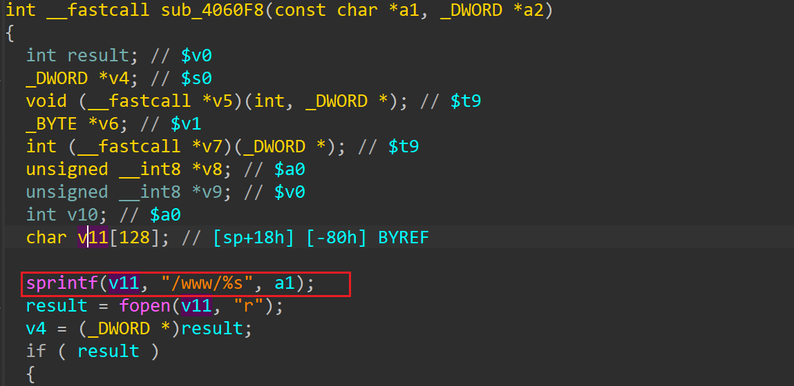
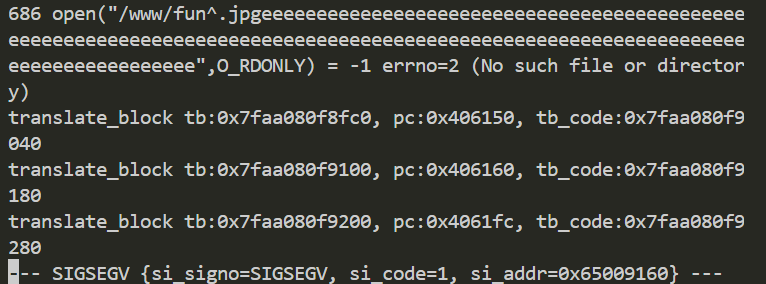

# jnr3300-1.0.0.34 stack-based buffer overflow vulnerability
## firmware version
vendor: netgear

product: jnr3300

version: below or equal jnr3300-1.0.0.34

firmware download url: https://www.downloads.netgear.com/files/GDC/JNR3300/JNR3300-V1.0.0.34PR.zip

## description
In netgear jnr3300-1.0.0.34, binary `/usr/sbin/uhttpd` contains a stack-based buffer overflow vulnerability. Attackers can send malicious packet to trigger the vulnerability.

## detail
Function `sub_4060F8` (address: 0x4060F8) contains a stack-based buffer overflow vulberability. Attackers can send malicious packet to cause DOS or execute arbitary code.

## send packet
You can send the POC packet via TCP to the `80` port of the firmware's web server to trigger the vulnerability.

## POC
see [POC](./poc)

## screenshot
The qemu logging shows that the web server encounters a crash and SEGSEGV signal has triggered. The PC is mis-aligned and contains special char(0x65, which is 'e', which is contained in poc), meaning stack buffer has been overwrited.

## timeline
[24/10/11] report to vendor and CVE