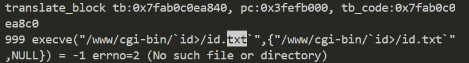

# jnr3300-1.0.0.34 command injection vulnerability
## firmware version
vendor: netgear

product: jnr3300

version: below or equal jnr3300-1.0.0.34

firmware download url: https://www.downloads.netgear.com/files/GDC/JNR3300/JNR3300-V1.0.0.34PR.zip

## description
In netgear jnr3300-1.0.0.34, binary `/usr/sbin/uhttpd` contains a command injection vulnerability. Attackers can send malicious packet to trigger the vulnerability.

## detail
Function `cgi_request` (address: 0x43055C) contains a command injection vulnerability. Attackers can send malicious packet to cau se command injection and execute arbitary command.

## POC
see [POC](./poc)

## screenshot
The qemu logging shows that the web server is launching a new program which is contained in our poc, meaning thet arbitary command can be executed(with path traversal).

## timeline
[24/10/11] report to vendor and CVE