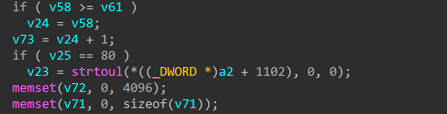
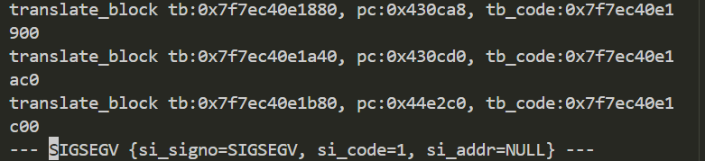

# jnr3300-1.0.0.34 DOS vulnerability
## firmware version
vendor: netgear

product: jnr3300

version: below or equal jnr3300-1.0.0.34

firmware download url: https://www.downloads.netgear.com/files/GDC/JNR3300/JNR3300-V1.0.0.34PR.zip

## description
In netgear jnr3300-1.0.0.34, binary `/usr/sbin/uhttpd` contains a DOS vulnerability. Attackers can send malicious packet to trigger the vulnerability.

## Impact
The vulnerability can eventually cause Denial Of Service

## detail
In function `cgi_request` (address: 0x43055C), If the parameter of strtoul is NULL, a NULL pointer dereference will happen and causes the web server to stop working. The root cause of the problem is the lack of `Content-Length` field in packet.

## send packet
You can send the POC packet via TCP to the `80` port of the firmware's web server to trigger the vulnerability.

## poc
see [poc](./poc)

## screenshot
The qemu logging shows that the web server encounters a crash and SEGSEGV signal has triggered.

## timeline
[24/10/11] report to vendor and CVE
