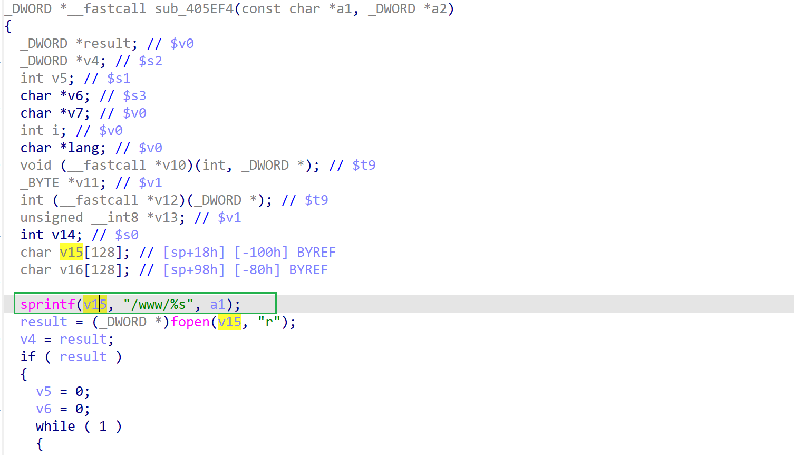

# jnr3300-1.0.0.34 stack-based buffer overflow vulnerability
## firmware version
vendor: netgear

product: jnr3300

version: below or equal jnr3300-1.0.0.34

firmware download url: https://www.downloads.netgear.com/files/GDC/JNR3300/JNR3300-V1.0.0.34PR.zip

## description
In netgear jnr3300-1.0.0.34, binary `/usr/sbin/uhttpd` contains a stack-based buffer overflow vulnerability. Attackers can send malicious packet to trigger the vulnerability.

## Impact
The vulnerability can eventually cause Denial Of Service or arbitary code execution.

## detail
Function `sub_405EF4` (address: 0x405EF4) contains a stack-based buffer overflow vulberability. Attackers can send malicious packet to cause DOS or execute arbitary code. The root cause is that the firmware concated input from user into locak stack without checking its lengtth.

## send packet
You can send the POC packet via TCP to the `80` port of the firmware's web server to trigger the vulnerability.

## POC
see [POC](./poc)
