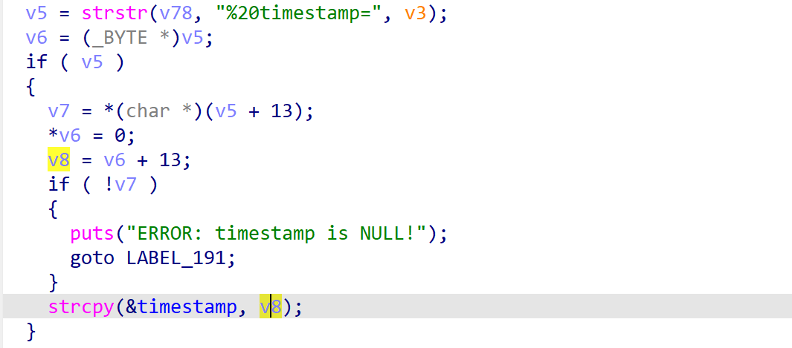

# jnr3300-1.0.0.34 global buffer overflow vulnerability
## firmware version
vendor: netgear

product: jnr3300

version: below or equal jnr3300-1.0.0.34

firmware download url: https://www.downloads.netgear.com/files/GDC/JNR3300/JNR3300-V1.0.0.34PR.zip

## description
In netgear jnr3300-1.0.0.34, binary `/usr/sbin/uhttpd` contains a global buffer overflow vulnerability. Attackers can send malicious packet to trigger the vulnerability.

## Impact
The vulnerability can eventually cause Denial Of Service or arbitary code execution.

## Detail
In the function `handle_request` of `/usr/sbin/httpd`, the following code parses user's input with field name `timestamp`.
The following code copied string after `timestamp` into global buffer `timestamp`(at 0x4B1F80), causing global buffer overflow

## POC
see [poc](./poc)

