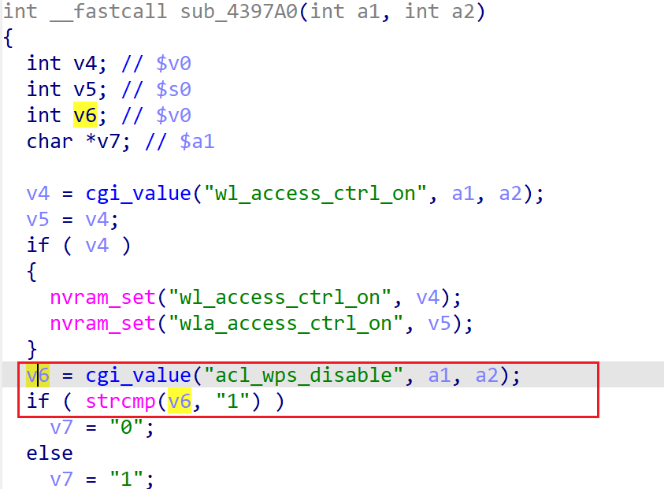

# xwn5001-0.4.1.1 DoS vulnerability
## firmware version
vendor: netgear

product: xwn5001

version: below or equal xwn5001-0.4.1.1

support url: https://www.netgear.com/support/product/xwn5001/#download

download url: https://www.downloads.netgear.com/files/GDC/XWN5001/XWN5001-V0.4.1.1.zip

## description
In netgear xwn5001-0.4.1.1, binary `/usr/sbin/uhttpd` contains a DoS vulnerability. Attackers can send malicious packet to trigger the vulnerability. The vulnerability lies in parsing and using parameter `acl_wps_disable` in function `sub_4397A0`.

## Impact
The vulnerability can cause Denial Of Service of the device.

## detail
In function `sub_4397A0` (address: 0x4397A0), the following code concats user's input containing `acl_wps_disable` into local variable `v6`.

However, it didn't check whether `v6` is NULL or not before use and dereference it in `strcmp`, causing potential NULL pointer dereference.

## poc
see [poc](./poc)

see [backtrace](./backtrce) for more information.
