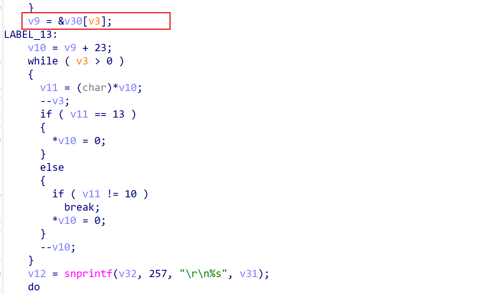

# xwn5001-0.4.1.1 uninitialized variable vulnerability
## firmware version
vendor: netgear

product: xwn5001

version: below or equal xwn5001-0.4.1.1

support url: https://www.netgear.com/support/product/xwn5001/#download

download url: https://www.downloads.netgear.com/files/GDC/XWN5001/XWN5001-V0.4.1.1.zip

## description
In netgear xwn5001-0.4.1.1, binary `/usr/sbin/uhttpd` contains auninitialized variable vulnerability. Attackers can send malicious packet to trigger the vulnerability. The vulnerability lies in function `sub_407114`.

## Impact
The vulnerability can cause Denial Of Service of the device.

## detail
In function `sub_407114` (address: 0x407114), the following code parses user's input.

However, it didn't initialize stack-based variable `v3` before use it as an index for a stack-based array, causing poiential array out-of-bound read and write, resulting in denial of service.

## poc
see [poc](./poc)

see [backtrace](./backtrace) for more information.